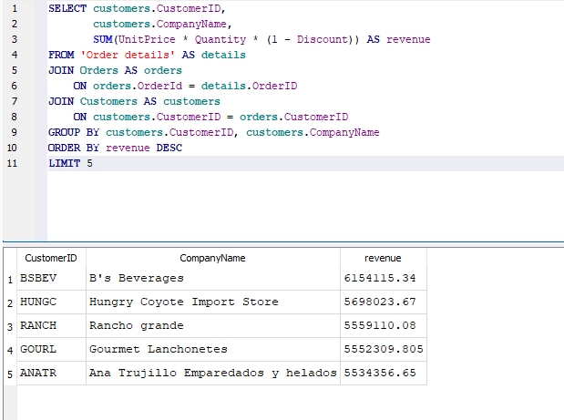
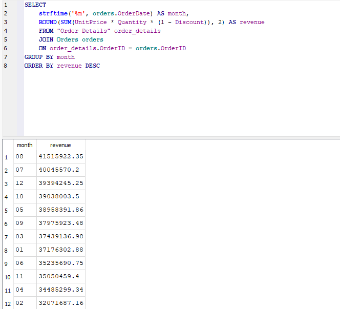
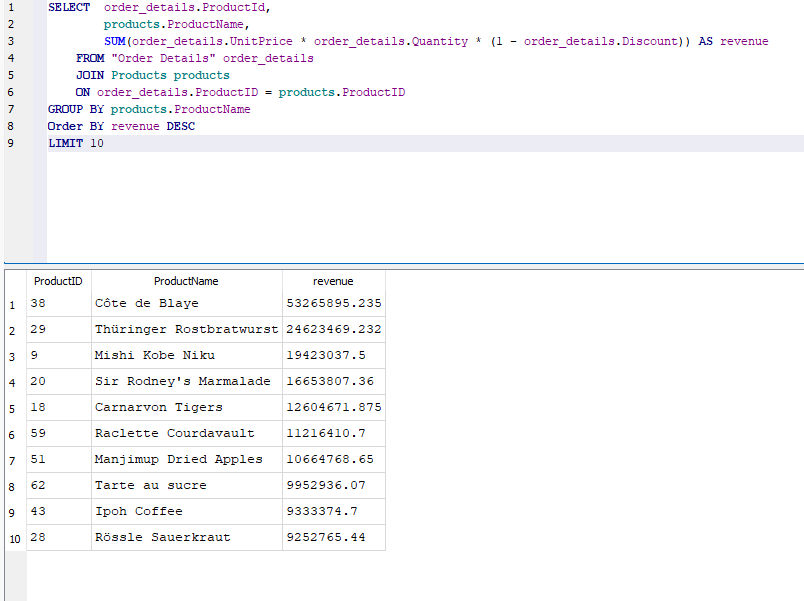
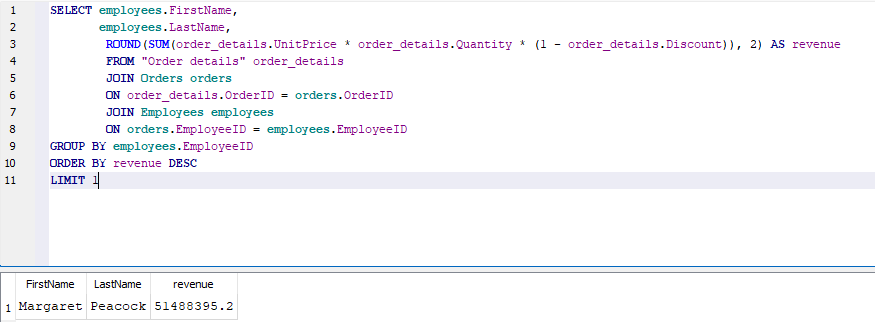

# Northwind SQL Analysis

This project simulates a real-world business data analysis using the classic Northwind database. It explores customer behavior, sales trends, product and category performance, and operational insights using SQL queries.

## 📁 Project Structure

```
northwind-sql-analysis/
├── database/ # SQLite database file
├── queries/ # All SQL scripts by theme
├── analysis/ # Business-style insights in plain language
├── schema/ # Database diagram
├── screenshots/               # Query output screenshots (query + result)
└── README.md # Project overview
```

## 🎯 Goals

- Practice real-world SQL querying
- Simulate an entry-level data analyst project
- Analyze key areas of a fictional retail company:
  - Customer segmentation
  - Sales performance over time
  - Product & category insights
  - Employee and shipper performance

## 📊 Themes Covered

| Theme                    | Description |
|--------------------------|-------------|
| Customer Behavior        | Top customers, repeat buyers, country-level segmentation |
| Sales Trends             | Revenue by month/year, average order value |
| Product Analysis         | Best sellers, category revenue, pricing |
| Operations & Logistics   | Employee activity, shipping delays, order handling |

## 🛠 Tools Used

- SQLite
- DB Browser for SQLite

## 📝 Dataset

- **Northwind Traders** sample database  
- Used in business and SQL training scenarios  
- [Original GitHub source](https://github.com/jpwhite3/northwind-SQLite3)

---

## 🖼️ Example Query Outputs

Below are sample screenshots from the analysis, showing both the SQL queries and the resulting insights:

### Top 5 Customers by Total Revenue
This query joins `Orders`, `Order Details`, and `Customers` to calculate revenue per customer and identify the top spenders.


### Monthly Revenue Breakdown
Calculates total revenue per month across all years to identify seasonal trends in sales.


### Top 10 Products by Revenue
Identifies which products generated the highest total revenue.


### Top Employee by Revenue Generated
Ranks employees based on the revenue they generated through completed orders.



## ✅ Status

- 🔹 SQL queries
- 🔹 Markdown insights
- 🔹 Visualizations


> Made as part of my data analysis projects portfolio. 


